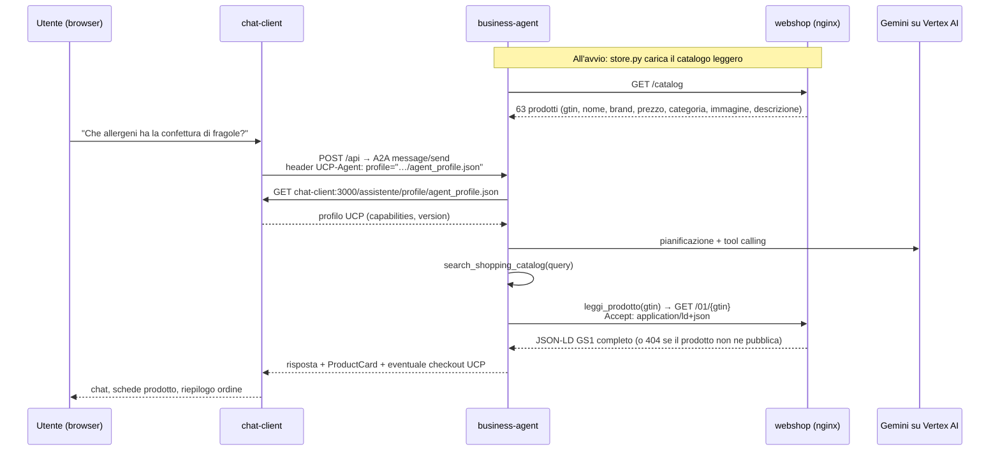

# Architettura tecnica

Sito GS1 Digital Link (Angular prerenderizzato) + assistente commerciale agentico
(Google ADK / A2A / UCP), in un unico `docker-compose` dietro Traefik.

Il codice dell'agente e della chat viene dal sample UCP di Google (`gs1_ucp_v2`):
è stato portato qui con modifiche minime e dichiarate. La differenza sostanziale è
la **sorgente dati**: nel sample era un finto shop FastAPI con 6 prodotti, qui è il
sito vero, con 63 prodotti e le schede GS1 che già pubblica.

---

## 1. I quattro servizi

| Servizio | Tecnologia | Porta interna | Esposto su | Ruolo |
|---|---|---|---|---|
| `traefik` | Traefik v3.7 | — | `${HTTP_PORT:-80}` | Reverse proxy, unico ingresso; in produzione anche TLS Let's Encrypt |
| `webshop` | Angular 22 prerenderizzato + nginx 1.29 | 80 | `/` | Il sito, e la **sorgente dati** dell'agente (`/catalog`, `/01/{gtin}`) |
| `business-agent` | Python 3.13, Google ADK + A2A + UCP | 10999 | *(nessun router)* | L'agente: ricerca, lettura schede GS1, checkout |
| `chat-client` | React 19 + Vite 6 (dev server) | 3000 | `/assistente`, `/api` | UI di chat e proxy verso l'agente |

Tutti sulla rete Docker `gs1-web` (nome esplicito: Traefik risolve
`--providers.docker.network` sul nome reale, non su quello prefissato da compose).

Il `business-agent` non ha alcun router Traefik: è raggiungibile solo dall'interno
della rete Docker, via `chat-client`.

## 2. Routing

Un solo dominio, quindi nessuna configurazione CORS in gioco:

```
/            → webshop       sito, pagine prodotto, sitemap, robots, llms.txt
/catalog     → webshop       feed JSON del catalogo (endpoint macchina)
/01/{gtin}   → webshop       scheda prodotto: HTML o JSON-LD secondo l'header Accept
/assistente  → chat-client   la chat React
/api         → chat-client   proxy Vite → business-agent:10999
```

Traefik dà priorità automatica alle regole più lunghe: `/assistente` e `/api`
vincono sul catch-all `PathPrefix(/)` del webshop, senza priorità esplicite.

Un middleware `redirectregex` traduce `/assistente` in `/assistente/`: Vite serve
l'app solo con la barra finale e non redirige da sé.

## 3. Flusso dei dati



## 4. Il webshop come sorgente dati

Il business-agent si aspetta esattamente due chiamate (`GET /catalog` e
`GET /01/{gtin}` con `Accept: application/ld+json`). Invece di riscrivere l'agente,
è il sito ad esporle — restando così anche genuinamente "agent-ready" verso
l'esterno.

### `generate-agent-feed.js`

Script postbuild (dopo `generate-seo-files.js`, vedi `package.json`), stessa forma
degli altri: legge `src/app/data/products.json`, scrive in `dist/gs1-catalog/browser`,
usa `SITE_URL`. Produce:

- **`catalog.json`** — vista leggera dei 63 prodotti, ~20 KB. I nomi dei campi non
  sono liberi: sono quelli letti da `store.py::_initialize_products` (`gtin`, `name`,
  `brand`, `price`, `priceCurrency`, `category`, `image`, `description`). L'immagine
  è un URL assoluto perché viene renderizzata dalla ProductCard, che sta su un'altra
  pagina. Volutamente **senza** la ricchezza GS1: quella arriva scheda per scheda.
- **`01/<gtin>/index.jsonld`** — il `rawGs1Data` del prodotto, stessa fonte del blocco
  `<script type="application/ld+json">` che la pagina già pubblica. Generato solo per
  i **47 prodotti su 63** che hanno dati strutturati.

### nginx (`webshop/nginx.conf`)

- `location = /catalog` → serve `catalog.json` come `application/json`. In Angular non
  esiste una pagina `/catalog` (solo `/catalog/:sector`), quindi il path era libero.
- `map $http_accept` + rewrite in `location /01/` → con `Accept: application/ld+json`
  la richiesta va sul sidecar `.jsonld`; altrimenti resta la pagina HTML.
- I 16 prodotti senza dati strutturati non hanno sidecar: **404**. È voluto — è il caso
  demo "non ancora AI Ready", e l'agente deve dichiarare di non poter verificare.
- `location = /health` per l'healthcheck del compose.

## 5. Il business-agent

Entrypoint `main.py` (server A2A Starlette, `/.well-known/ucp`, statici `/images`),
agente in `agent.py`, store e checkout in `store.py`. Modello via `GEMINI_MODEL`.

### Tool

| Tool | Cosa fa |
|---|---|
| `search_shopping_catalog(query)` | Restituisce il catalogo leggero |
| `leggi_prodotto(gtin)` | Scarica il JSON-LD GS1 completo della scheda |
| `add_to_checkout` / `remove_from_checkout` / `update_checkout` / `get_checkout` | Gestione carrello UCP |
| `update_customer_details` / `start_payment` / `complete_checkout` | Dati cliente, pagamento (mock), conferma ordine |

Checkout: valuta EUR, tassa forfettaria 10% e spedizione applicate quando c'è un
indirizzo di consegna, pagamento simulato da `MockPaymentProcessor`.

### Modifiche rispetto al sample (le uniche due)

1. **`store.py::search_products`** — il sample filtrava per keyword su nome e categoria.
   Con un catalogo italiano le denominazioni commerciali non coincidono col linguaggio
   comune ("marmellata" non trova "Confettura") e quasi ogni ricerca falliva. Ora
   restituisce l'intero catalogo leggero (~20 KB, ~5,5k token) e lascia scegliere al
   modello. Tutto il resto di `RetailStore` è invariato.
2. **`agent.py::instruction`** — il testo era tarato solo su cibo (allergeni, nutrienti).
   Esteso ai sei settori del catalogo (materiali tessili, certificazioni, sostenibilità,
   tracciabilità) e, soprattutto, con la regola sui prodotti senza dati: se
   `leggi_prodotto` fallisce, dichiararlo invece di colmare il vuoto con conoscenza
   generale. Aggiunta la lingua di risposta (italiano di default).

Tutto il resto — `agent_executor.py`, `ucp_profile_resolver.py`, `a2a_extensions/`,
`models/`, `helpers/`, `payment_processor.py`, i tool di checkout — è copiato tale e quale.

## 6. Il chat-client

Dev server Vite (come nel sample), servito sotto `/assistente/`.

- `base: '/assistente/'` in `vite.config.ts`. Il proxy `/api` resta registrato alla
  radice ed è indipendente dal base: il `fetch("/api")` di `App.tsx` continua a funzionare.
- Il **profilo UCP** è risolto lato server: è il business-agent a scaricarlo, quindi
  `VITE_PROFILE_URL` deve puntare al nome di servizio Docker
  (`http://chat-client:3000/assistente/profile/agent_profile.json`), non a `localhost`.
- `config.ts`: logo risolto su `import.meta.env.BASE_URL`, testi in italiano.
- `App.tsx` e i componenti UCP (`ProductCard`, `Checkout`, `PaymentMethodSelector`,
  `PaymentConfirmation`) non sono stati toccati.

## 7. Angular: la pagina `/assistente`

La finta chat Angular (`src/app/pages/chat/`) non è più raggiungibile:

- rotta rimossa da `app.routes.ts` e dal prerender in `app.routes.server.ts`;
- i due link in `app.html` sono passati da `routerLink` a `href`, altrimenti il router
  Angular intercetterebbe il click senza mai passare da Traefik;
- `/assistente` tolto dalla sitemap; `llms.txt` ora annuncia anche i due endpoint macchina.

Il componente resta nel repo come simulazione di riferimento, non referenziato.

## 8. Configurazione

| Variabile | Servizio | Note |
|---|---|---|
| `GOOGLE_CLOUD_PROJECT` | business-agent | Obbligatoria, progetto GCP per billing/quota Vertex |
| `GOOGLE_CLOUD_LOCATION` | business-agent | Default `global` |
| `GEMINI_MODEL` | business-agent | Default `gemini-3.5-flash` |
| `GOOGLE_APPLICATION_CREDENTIALS` | business-agent | `/creds/sa.json`, montato da `secrets/gcp-sa.json` |
| `CATALOG_URL` | business-agent | `http://webshop` (fisso nel compose) |
| `VITE_PROXY_TARGET`, `VITE_PROFILE_URL` | chat-client | Fissi nel compose |
| `SITE_URL` | webshop (build-time) | Finisce in canonical, sitemap, robots, llms.txt e negli URL immagine del feed |
| `WEBSHOP_HOST`, `ACME_EMAIL` | traefik (produzione) | Dominio e account Let's Encrypt |
| `HTTP_PORT` | traefik (locale) | Se la 80 è occupata |

**Segreti**: `.env` e `secrets/gcp-sa.json` sono in `.gitignore`. Sul droplet vanno
caricati a mano (`scp`): `git pull` non li porta.

`SITE_URL` è build-time (è scritto dentro i file generati), `WEBSHOP_HOST` è runtime:
cambiare il primo richiede `--build`, il secondo solo un `up -d`.

## 9. Avvio

```bash
# locale — http://localhost
docker compose up -d --build

# produzione (droplet) — richiede .env con WEBSHOP_HOST, SITE_URL, ACME_EMAIL
docker compose -f docker-compose.yml -f docker-compose.prod.yml up -d --build
```

Verifiche rapide:

```bash
curl -s http://localhost/catalog | jq length                                  # 63
curl -H 'Accept: application/ld+json' http://localhost/01/08032089000017      # JSON-LD
curl -o /dev/null -w '%{http_code}\n' -H 'Accept: application/ld+json' \
     http://localhost/01/08032089000048                                       # 404 (non AI-Ready)
```

## 10. Note operative

- **429 `RESOURCE_EXHAUSTED` da Vertex.** Intermittenti su `gemini-3.5-flash` + region
  `global`: al ritentativo passano. Dipendono dalla quota condivisa del progetto GCP,
  non dal service account — cambiarlo non risolve.
- **Traefik v3.3 non funziona con Docker 29.x**: usa una versione di API rifiutata dal
  daemon e il provider Docker resta muto (404 su tutto). Da qui la v3.7.
- **Healthcheck su `127.0.0.1`, non `localhost`**: il wget di busybox prova prima `::1`,
  dove nginx (`listen 80`, solo IPv4) non ascolta.
- **`.npmrc` va copiato prima di `npm ci`** nel Dockerfile del webshop: contiene
  `legacy-peer-deps=true`, senza cui la build fallisce sul peer di `angularx-qrcode`.
- **Vite in dev server anche in produzione**: è così anche nel sample, accettabile in
  demo. L'alternativa (build statica + router Traefik `/api` → agente con StripPrefix)
  resta possibile.
- **Residui cosmetici del sample**: `agent_card.json` si presenta ancora come
  "SuperStore Merchant Agent" (visibile solo in discovery A2A) e `business-agent/data/images/`
  contiene le immagini dei prodotti del sample, non più usate.

## 11. Riferimenti file

- `docker-compose.yml` / `docker-compose.prod.yml` — servizi, routing, TLS
- `webshop/Dockerfile`, `webshop/nginx.conf` — build Angular e serving
- `generate-agent-feed.js` — feed `/catalog` e sidecar `.jsonld`
- `generate-seo-files.js` — sitemap, robots, llms.txt, correzione dominio nel prerender
- `business-agent/src/business_agent/{agent,store,main}.py` — agente, catalogo, server A2A
- `chat-client/{vite.config.ts,config.ts,App.tsx}` — proxy, UI, chiamate A2A/UCP
